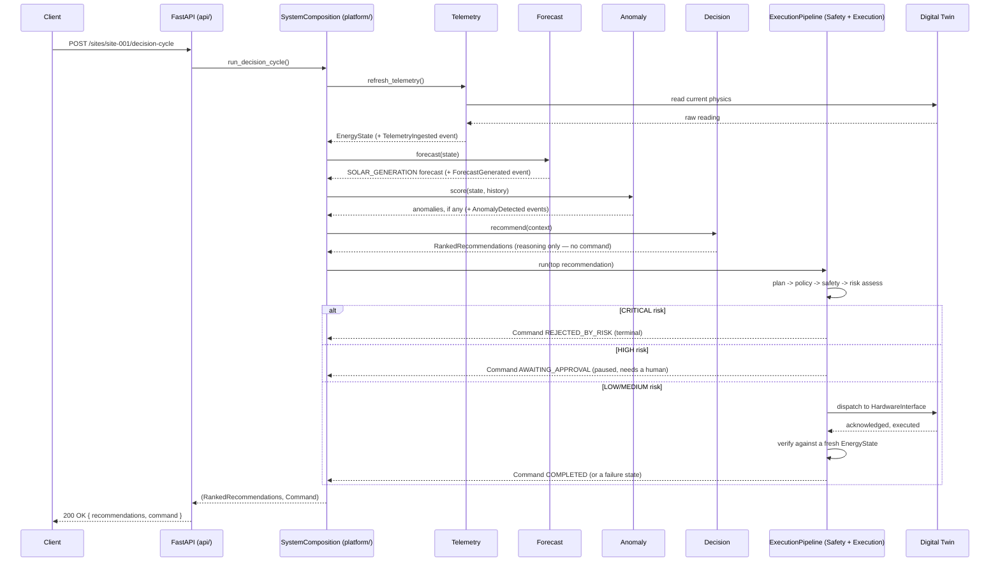

# SolarOps AI — Project Deep Dive

*A complete, defensible walkthrough of what this system is, how it was built,
why every major decision was made the way it was, and what actually went
wrong along the way.*

This document exists to be read cover-to-cover by someone who has never seen
the code — including you, before a defense — and come out able to explain
every folder, every library, and every scar. It is deliberately more
narrative than `README.md` (which is a reference) or `DEPLOYMENT.md` (which
is an operations doc). Where this document says something happened, it
happened — errors and false starts are described exactly as they occurred,
not smoothed over.

---

## Table of contents

1. [What this system is, in one page](#1-what-this-system-is-in-one-page)
2. [How it started](#2-how-it-started)
3. [The build order — what got done, phase by phase](#3-the-build-order--what-got-done-phase-by-phase)
4. [The core architectural idea, explained simply](#4-the-core-architectural-idea-explained-simply)
5. [Folder-by-folder tour](#5-folder-by-folder-tour)
6. [How it's all wired together](#6-how-its-all-wired-together)
7. [Every library, and why it's the one we picked](#7-every-library-and-why-its-the-one-we-picked)
8. [The database and infrastructure layer](#8-the-database-and-infrastructure-layer)
9. [Testing strategy](#9-testing-strategy)
10. [War stories — the real errors and how they were actually fixed](#10-war-stories--the-real-errors-and-how-they-were-actually-fixed)
11. [The safety model (why a command can't just... run)](#11-the-safety-model-why-a-command-cant-just-run)
12. [What's deliberately left undone](#12-whats-deliberately-left-undone)
13. [Defense prep — likely questions and sharp answers](#13-defense-prep--likely-questions-and-sharp-answers)
14. [Command-line cheat sheet](#14-command-line-cheat-sheet)

---

## 1. What this system is, in one page

SolarOps AI is a control plane for a commercial solar + battery + inverter +
grid-tied energy site. It watches telemetry, forecasts solar generation,
detects equipment faults, decides what action would help (charge the
battery, shed load, export to the grid, ...), and — only if that action
clears a chain of independent safety checks — actually sends it to hardware.

The one sentence that governs every architectural decision in this
repository:

> **The AI owns reasoning. The Control Plane owns execution. The AI never
> touches hardware directly.**

Concretely: the code that decides *what* to do (Decision, Forecast, Anomaly)
is structurally incapable of importing the code that's allowed to *do* it
(Execution) — not by convention, but because a CI-enforced import rule makes
it a build failure. A recommendation is just data. Only the Execution
context, after Safety has signed off, can turn that data into a real command
sent to (in this system, simulated) hardware.

Everything else in this document is really just elaborating on how that one
rule gets enforced at every layer: in the code's package structure, in the
`Command` aggregate's state machine, in the test suite, and now in how the
whole thing gets deployed.

---

## 2. How it started

The project didn't start with code. It started with two specification
documents that were treated as the actual contract to build against, the
same way a real engineering org would work from an approved design doc
rather than "vibes":

- **Document 7 — Command Execution & Safety Framework (CESF).** Defines the
  safety *policy*: the four-tier risk classification (LOW auto-executes,
  MEDIUM auto-executes but notifies, HIGH needs a human, CRITICAL is
  auto-rejected — CESF §8), the audit requirement, the fail-safe rule, and
  the numbered Architecture Decision Records up through ADR-012 (e.g.
  ADR-011: acknowledgement alone never completes a command; ADR-012: if the
  safety port errors, the default is reject, never "assume safe").
- **Document 8 — Domain-Driven Design Specification** (`docs/08-domain-driven-design-spec.md`).
  Translates CESF's policy into an actual software architecture: the bounded
  contexts, the dependency rules between them, the `Command` aggregate's
  state machine, and — critically — **§11, "Mapping to the Build Order"**,
  a table that says, in order: shared kernel first (zero dependencies, so
  it's the safest place to make mistakes), then the Digital Twin and
  telemetry, then state persistence, then a stub reasoning workflow, then
  the *entire* safety/execution pipeline (deliberately before any real AI
  logic existed), then real forecasting/anomaly/decision logic, then the
  outward-facing API/dashboard/observability layer.

That ordering is a deliberate, defensible engineering choice, not
arbitrary: **the safety pipeline (Phase 5) was built and fully tested
against a dumb stub recommendation, before any real "AI" reasoning existed.**
The system could reject, gate, and audit a command correctly before it could
generate an interesting one. If you build the brain first and the guardrails
second, every guardrail decision gets made under pressure to not break the
demo. Building the guardrails first means the brain was never able to ship
without them.

From there, the project was executed as a series of **phase briefs** —
`docs/phase5-...` through `docs/phase8-...`, each one a scoped, written
spec for one slice of the system, reviewed and signed off before being
built. That's why the repository still has every brief checked in: they're
not historical clutter, they're the actual reason any given file looks the
way it does. If you want to know *why* a piece of code exists, the brief for
its phase is the primary source, not a guess from reading the diff.

---

## 3. The build order — what got done, phase by phase

The original Doc 8 §11 plan was seven phases. In practice, phases 6 and 7
each split into focused sub-phases as the work turned out to need it —
a sign the plan was being followed with judgment, not treated as gospel once
reality (accuracy gates that didn't clear, a confidence metric that
miscalibrated) disagreed with it.

| Phase | What it actually delivered |
|---|---|
| **1** | The shared kernel: typed IDs (`SiteId`, `AssetId`, `CommandId`, ...), self-validating physical value objects (`Power`, `Energy`, `StateOfCharge`, ...), the domain enums, `DomainEvent`, the `Clock` port. Zero framework dependencies — pure Python standard library. |
| **2–3** | The Digital Twin (`simulation/`) — a physics-based simulator for solar panels, a battery, an inverter, the grid connection, and building load, complete with injectable faults (overtemp, comm loss, grid outage, ...). Telemetry ingestion and the Layer-1 state store on top of it. |
| **4** | The first LangGraph workflow (`workflow/`) — a one-node graph (`START → decision → END`) behind a stub recommendation, just to prove the orchestration shape before there was anything real to orchestrate. |
| **5** | **The entire command safety pipeline** — `PolicyValidator`, `SafetyValidator`, `RiskAssessor`, `ApprovalEngine`, `ExecutionManager`, `VerificationService`, and the `Command`/`ApprovalRequest` aggregates with their full CESF-mirroring state machines. Built and fully tested against the Phase 4 stub recommendation — see §2 above for why that ordering mattered. |
| **6a** | Real solar generation forecasting (`forecast/`) — a `SolarBaseline` model behind a pluggable `ForecastModel` interface, gated by a real accuracy evaluator before anything gets registered. Load and Battery-SOC forecasters were also attempted here; both failed their accuracy gate and were **not** registered (see §12). |
| **6b** | Real anomaly detection (`anomaly/`) — rule-based, statistical, and Isolation Forest detectors behind one interface, each type independently gated per fault category rather than pass/fail as a block (the "per-check gating" cleanup pass, `docs/phase6b-cleanup-per-check-gating.md`). |
| **6c** | The real `RuleBasedOptimiser` (`decision/`) replacing the Phase 4 stub — reasons over current state, whatever forecasts are actually registered, and active anomalies; never touches the twin, never builds a command (ADR-010). |
| **6d** | A confidence-scoring layer on top of 6c's recommendations — degrades gracefully (falls back to a more conservative action) when the reasoning inputs themselves look unreliable (stale data, an active anomaly, missing forecasts). This phase is also where the project's biggest debugging saga happened — see §10.1. |
| **7a** | The FastAPI edge (`api/`) — a thin HTTP layer over everything built so far, one composition root (`SystemComposition`) built once at process startup. |
| **7b** | The Streamlit operator dashboard (`dashboard/`) — a standalone program that talks to the API over plain HTTP and imports nothing from `solarops` (verified by a literal `grep`, not just a design intention). |
| **7c** | Real observability — Prometheus metrics wired through the pipeline's existing domain-event emission points, plus provisioned Grafana dashboards. |
| **8** | Dockerization — real Redis/Postgres/MLflow behind an environment-variable switch, with the in-memory/fake path preserved as the default so the test suite never depends on a container. |

One thing worth being upfront about: the original Doc 8 plan named **MLflow,
Langfuse, Prometheus, and Grafana** together as the Phase 7 observability
stack. Langfuse (LLM-specific tracing) was scoped but never built — the
system's "AI" is a rule engine with pluggable ML detectors, not an LLM
pipeline, so LLM-tracing tooling stopped being the right fit as the design
concretized, and Prometheus/Grafana (Phase 7c) covered the observability
need that actually existed. That's a real, disclosed scope change, not an
oversight — it's exactly the kind of thing you say plainly in a defense
rather than hope nobody asks about.

---

## 4. The core architectural idea, explained simply

Three ideas, stacked:

**1. Domain-Driven Design, with real bounded contexts.** The system isn't
one blob of code — it's twelve packages under `src/solarops/`, each owning
one concern (Telemetry, Forecast, Anomaly, Decision, Safety, Execution,
Simulation, ...), each internally split into `domain / application /
infrastructure`. A `Command` aggregate lives in Execution's `domain/` layer
and knows nothing about Postgres, FastAPI, or Redis — it's pure Python
business logic. The SQLAlchemy code that persists it lives in Execution's
`infrastructure/` layer and depends *inward* on the domain, never the other
way around. This is standard hexagonal/clean architecture, applied
literally rather than as a slide.

**2. Ports and adapters (dependency inversion) for anything crossing a
boundary.** When a context needs something from outside itself — Execution
needs to send a command to hardware, Execution needs to record a Prometheus
metric — it defines a `Protocol` (an interface) for the *shape* it needs,
inside its own `domain/ports.py`. It never imports the concrete
implementation. `ExecutionMetricsRecorder` is a Protocol owned by Execution;
the real `PipelineMetrics` class (which does import `prometheus_client`)
lives in `observability/`, and the only place that imports *both* and wires
them together is the composition root. This is why swapping the Digital
Twin for real hardware later only touches one adapter class, not the whole
Execution context.

**3. A single composition root.** All of that wiring — building every
service, injecting every port's real implementation, choosing in-memory vs.
real infrastructure — happens in exactly one place:
`src/solarops/platform/api_composition.py`, in a class called
`SystemComposition`. Nothing else in the codebase is allowed to do this
wiring, which is what makes `platform/` (and `api/`, and `workflow/`) exempt
from the import-linter's dependency rules: composition roots are *allowed*
to import every context, precisely because their only job is wiring, not
business logic.

These three ideas combine into the property the whole system is actually
built to guarantee: **"the AI cannot execute" is a fact the compiler/import
system can check, not a code-review hope.** `solarops.decision` physically
cannot `import solarops.execution` — `import-linter` fails the build if it
tries. That's the whole game.

---

## 5. Folder-by-folder tour

```
SolarOps/
├── src/solarops/          # the actual system (see below)
├── dashboard/              # Streamlit operator UI — standalone, HTTP-only client
├── monitoring/             # Prometheus scrape configs + provisioned Grafana dashboards
├── docker/                 # extra Dockerfiles (currently: the MLflow server image)
├── scripts/                # one runnable demo entry point per context
├── tests/                  # unit tests (mirrors src/solarops/ 1:1) + dashboard tests + integration tests
├── docs/                   # the DDD spec, the AI evaluation framework, and every phase brief
├── Dockerfile               # the API container
├── docker-compose.yml       # api + redis + postgres + mlflow (+ prometheus/grafana on a profile)
├── docker-compose.monitoring.yml   # standalone Prometheus+Grafana for a host-run API (Phase 7c)
├── pyproject.toml           # dependencies, pytest config, ruff config, import-linter contracts
├── .env.example              # every environment variable, documented, no real secrets
├── README.md                 # architecture reference
├── DEPLOYMENT.md              # how to actually run the dockerized stack
└── PROJECT_DEEP_DIVE.md        # this document
```

### `src/solarops/` — the twelve packages

| Package | Layer split? | What it owns |
|---|---|---|
| `shared_kernel/` | no (leaf) | Typed IDs, physical value objects, domain enums, `DomainEvent`/`EventEnvelope`, the `Clock` port. The *only* package every other context is allowed to import. Zero dependencies on anything else in the project — enforced by its own import-linter contract. |
| `simulation/` | domain/application/infrastructure | The Digital Twin: physics models for the solar array, battery, inverter, grid connection, and building load, plus injectable faults. Stands in for real hardware. May depend on `shared_kernel` only — it must never know Telemetry, Decision, or anything else exists. |
| `telemetry/` | domain/application/infrastructure | Ingests raw readings from a `TelemetrySource`, builds the `EnergyState` snapshot, tracks it in a `StateStore` (Layer 1 working memory). May depend on `shared_kernel` only — notably, *not* Simulation; the adapter that bridges the twin into a `TelemetrySource` lives in `platform/`, not here. |
| `forecast/` | domain/application/infrastructure | Predicts Solar Generation / Building Load / Battery SOC. Reasons only. A `ForecastModel` behind a swappable interface; nothing is registered for real use until it clears a real accuracy gate. |
| `anomaly/` | domain/application/infrastructure | Detects equipment faults from telemetry: rule-based, statistical, and Isolation Forest detectors behind one `AnomalyDetector` interface. Reasons only. |
| `decision/` | domain/application/infrastructure | Owns `Recommendation` and the `RuleBasedOptimiser`. Reasons only — never touches the twin, never builds a `Command` (ADR-010). May depend on `shared_kernel`, `telemetry`, and `forecast`. |
| `safety/` | domain/application/infrastructure | `PolicyValidator` (configurable operational rules) and `SafetyValidator` (hard physical limits, never relaxed) — two *independent* gates — plus `RiskAssessor`, which classifies a command into LOW/MEDIUM/HIGH/CRITICAL per CESF §8. |
| `execution/` | domain/application/infrastructure | The crown jewel. Owns the `Command` aggregate (its full lifecycle state machine) and the separate `ApprovalRequest` aggregate (ADR-017), plus `ExecutionPipeline`, which drives a recommendation through policy → safety → risk → approval → dispatch → verify. The *only* context allowed to touch a `HardwareInterface`. |
| `observability/` | leaf | Every Prometheus metric definition (`Counter`/`Histogram`/`Gauge`). Imports nothing from any bounded context; every context's import-linter contract forbids depending on it back — metrics are recorded through Protocols the *owning* context defines (see §4, point 2), never by contexts reaching into `observability` directly. |
| `workflow/` | composition root | A LangGraph graph (`START → decision → END`) wrapping the Decision engine. **Worth being precise about:** this is exercised by its own tests and by `scripts/run_decision_pipeline.py`, but the live API request path (`platform/api_composition.py`) calls `RuleBasedOptimiser.recommend()` directly — it does not currently route through this LangGraph graph. LangGraph is a real, working, tested piece of this system; it's just not (yet) the thing that serves `/decision-cycle`. Said plainly here rather than glossed over. |
| `platform/` | composition root | Where every context actually gets instantiated and wired into one `SystemComposition` — see §6. Also owns the twin-hardware/twin-telemetry adapters that need to know about both Simulation and another context, which is exactly the kind of wiring no single bounded context is allowed to do itself. |
| `api/` | composition root (edge) | The FastAPI app. Fourteen HTTP endpoints (see `README.md`'s API surface table) over the `SystemComposition` built once at startup. May import every context freely; no context may import it back. |

### Outside `src/solarops/`

- **`dashboard/`** — a Streamlit app that is, deliberately, not part of the
  `solarops` package at all. It's a separate installable extra
  (`pip install -e ".[dashboard]"`) with its own `api_client.py` that speaks
  plain HTTP to the FastAPI app. The "thin client" rule
  (`grep -rn "solarops" dashboard/` must return zero real imports) is
  checked as part of every polish pass made to it, not just claimed.
- **`monitoring/`** — Prometheus's scrape config and two hand-built,
  auto-provisioned Grafana dashboards (Operations; AI & Safety), plus a
  second scrape config (`prometheus.docker.yml`) for when the API itself is
  also containerized.
- **`scripts/`** — one file per context that exercises it standalone
  (`run_simulator.py`, `run_telemetry_pipeline.py`,
  `run_forecast_training_and_evaluation.py`,
  `run_anomaly_detection_evaluation.py`, `run_decision_pipeline.py`,
  `run_execution_pipeline_happy_path.py` / `_unsafe.py`, `run_api.py`).
  These predate the API and are still useful for exercising one context
  without booting the whole system.
- **`tests/`** — `tests/unit/` mirrors `src/solarops/` package-for-package;
  `tests/integration/` holds the handful of tests that need a real service
  (currently: one Redis integration test, skipped automatically if Redis
  isn't reachable); `tests/dashboard/` drives the Streamlit app headlessly
  against a real, in-process FastAPI instance.
- **`docs/`** — the two founding specs (`08-domain-driven-design-spec.md`,
  `06-AI-Evaluation-Framework.md`) and one brief per phase from Phase 5
  onward. `deferred-items.md` is the honest running list of known gaps
  (§12).

---

## 6. How it's all wired together

### 6.1 The composition root, step by step

`SystemComposition.__init__` (in `platform/api_composition.py`) is the one
place in the entire codebase where every context meets every other context.
Reading it top to bottom *is* reading how the system fits together:

1. **Build the Digital Twin** (`simulation.DigitalTwin`), seeded with the
   real current time.
2. **Wrap the twin in a `TelemetrySource`** (`TwinTelemetrySource`, defined
   in `platform/` because it's the one file allowed to know about both
   Simulation and Telemetry) and build the Telemetry ingestion service and
   state store on top of it.
3. **Build Safety's static inputs** — the site's `Policy` and
   `SafetyLimits`.
4. **Train and register the Forecast models** that pass their accuracy
   gate (today: Solar only — see §12) via a real `ForecastEvaluator`
   against benchmark scenarios drawn from the twin.
5. **Train and register the Anomaly detectors** that pass their per-type
   gate (today: Rule and Statistical — Isolation Forest never passed) the
   same way.
6. **Build the Decision engine** (`RuleBasedOptimiser`) over whatever
   Forecast/Anomaly actually produced.
7. **Build the Execution pipeline** — `CommandPlanner`, `PolicyValidator`,
   `SafetyValidator`, `RiskAssessor`, `ApprovalEngine`, `ExecutionManager`,
   `VerificationService` — wired to a `SimulatedHardwareInterface` that
   drives the *same* twin instance from step 1, closing the loop: a
   dispatched command actually changes the physics the next telemetry read
   sees.
8. **Pull one real telemetry reading** before the constructor returns, so
   the very first HTTP request never sees an empty state.

Every one of those objects is either a real domain/application service
(pure business logic) or one of two flavors of infrastructure adapter,
chosen per-concern by `PlatformSettings.use_real_infra`
(`SOLAROPS_ENV=production` vs. the default `local`): in-memory/fake, or the
real thing (Redis, Postgres, MLflow). See §8 for exactly which is which.

### 6.2 What actually happens on `POST /sites/{id}/decision-cycle`



Every arrow into and out of `Pipe` also appends to the audit log and, where
a metric exists for it, increments a Prometheus counter — both happen at the
same `_audit(event)` chokepoint inside `ExecutionPipeline`, which is why
adding Prometheus instrumentation in Phase 7c never had to touch the
pipeline's actual decision logic (see §10.2).

---

## 7. Every library, and why it's the one we picked

| Library | Used for | Why this one, not an alternative |
|---|---|---|
| **Pydantic v2** | `EnergyState` and every API request/response schema | Runtime validation *and* JSON (de)serialization from one model definition, with real speed (Rust core in v2) — avoids hand-written validation code at every boundary. Deliberately **not** used for domain aggregates like `Command`, which are plain classes with hand-written invariants — Pydantic validates shape, not business rules, and the aggregate's job is exactly the latter. |
| **pydantic-settings** | `APISettings`, `PlatformSettings` | Environment-variable configuration that's still a typed, validated object, not `os.environ.get()` scattered through the codebase. One consistent pattern (`SOLAROPS_` prefix, `.env` support) used everywhere config is needed. |
| **FastAPI** | the entire `api/` package | Async-native, generates OpenAPI/`/docs` for free from the same Pydantic models already used for validation, and its `Depends()` system is a clean way to hand routers the one shared `SystemComposition` without a global. Chosen over Flask/Django for the free schema generation and native async; chosen over a bare ASGI framework because request validation was needed everywhere anyway. |
| **Uvicorn** | running the FastAPI app | The standard production ASGI server for FastAPI; nothing exotic here. |
| **Redis** | the Telemetry `StateStore` (Layer 1 working memory) | Sub-millisecond reads for "what's the current state right now," which is on the hot path of every decision cycle. A relational database is the wrong tool for a single mutable current-value read; Redis is purpose-built for it. Real usage is opt-in (`SOLAROPS_ENV=production`) — `InMemoryStateStore` is the default so tests never need a running Redis. |
| **SQLAlchemy (Core, not ORM)** | `PostgresAuditLog` | Durable storage for the immutable audit trail. Core (not the ORM) was a deliberate choice for this one adapter: a plain `Table` + explicit `insert`/`select` statements is far easier to review for correctness by reading it — which mattered a great deal here, since this adapter was written and shipped without ever being able to run it against a live Postgres instance in the build environment (see §10.4). |
| **psycopg (v3, binary)** | the actual Postgres driver underneath SQLAlchemy | The modern, actively maintained psycopg — v2 is legacy-maintenance-only. `[binary]` avoids needing a C compiler toolchain in the container image. |
| **MLflow** | forecast/anomaly model registries (`MLflowModelRegistry`, `MLflowDetectorRegistry`) | Versioned experiment tracking (params, metrics, model versions) *for free*, rather than hand-rolling a "which model version is currently active" table. Every model/detector registration is a real MLflow run — inspectable independently of the running process. Runs against a local SQLite file by default (no infra needed for tests/local dev) and against a real MLflow tracking server under Docker — same client code either way, because `mlflow.set_tracking_uri()` takes any URI. |
| **scikit-learn** | the Isolation Forest anomaly detector, evaluation metrics | The standard, well-tested choice for a classical (non-deep-learning) anomaly detection model, and its evaluation utilities (precision/recall) were reused directly for the Phase 6a/6b accuracy gates. |
| **XGBoost** | one of the forecasting model candidates evaluated in Phase 6a | A strong classical baseline for tabular time-series regression, tried against the Load/Battery-SOC forecasting targets. It didn't clear the accuracy gate for those two targets (see §12) — its presence in the dependency list is honest evidence of what was *tried*, not just what shipped. |
| **LangGraph** | `workflow/graph.py` | The orchestration library named in the original Doc 8 plan for wiring reasoning steps into a graph. Built and tested (§5, `workflow/`) as a one-node proof of the intended shape; not yet the thing serving live traffic (see §5's note on `workflow/`) — disclosed, not hidden. |
| **prometheus-client** | `observability/metrics.py` | The reference Python client for Prometheus's exposition format. Module-level singleton `Counter`/`Histogram`/`Gauge` objects avoid the "duplicated timeseries" error that comes from creating them per-request or per-`SystemComposition` instance. |
| **Streamlit** | the whole `dashboard/` app | Lets a full operator UI (six pages, live charts, an approve/reject workflow) get built in pure Python with no separate frontend build step — appropriate for an internal operator tool where iteration speed matters more than a custom design system. Its own test runner (`streamlit.testing.v1.AppTest`) is what makes `tests/dashboard/` possible without a real browser. |
| **Plotly** | dashboard charts (the battery gauge, the solar-vs-load chart) | Renders interactive charts inside Streamlit with minimal code and a themeable `Figure` API — used instead of Matplotlib because Streamlit's `st.plotly_chart` gives interactivity (hover, zoom) for free. |
| **httpx** | `dashboard/api_client.py`, and the API's own test client | A modern, typed HTTP client with both sync and async support — used as the dashboard's only connection to `solarops`, keeping the "thin client" boundary real rather than aspirational. |
| **pytest** | the entire test suite | The standard Python test runner; `pytest-cov` for coverage reporting. |
| **ruff** | linting (`E`, `F`, `I`, `UP`, `B`, `SIM` rule sets) | One fast tool doing the job that used to take flake8 + isort + pyupgrade + bugbear separately. |
| **mypy** (`strict = true`) | static type checking on `src/` | Strict mode was chosen deliberately for a safety-critical system — catching a wrong type at review time is strictly better than catching it at 2am in a fail-safe branch. |
| **import-linter** | the 9 architecture contracts in `pyproject.toml` | The single most load-bearing dev-dependency in this list: it's what turns "Decision must never import Execution" from a design intention into a CI failure. No other tool in the Python ecosystem does this job as directly. |
| **fakeredis** | `InMemoryStateStore`'s test-time real-Redis-API sibling, used in the Redis adapter's own unit tests | Lets `RedisStateStore` be unit-tested against something that behaves like real Redis, without a running Redis server — the integration test that needs an *actual* Redis is separate and auto-skips when one isn't reachable. |

---

## 8. The database and infrastructure layer

### 8.1 The switch

Exactly one environment variable decides whether the system talks to real
infrastructure: `SOLAROPS_ENV`. `local` (the default — what every test, and
every `python scripts/run_api.py` invocation, uses unless told otherwise)
selects in-memory/fake adapters everywhere. `production` (set by the `api`
service in `docker-compose.yml`) selects the real ones. This lives in
`platform/settings.py`'s `PlatformSettings`, read once by
`SystemComposition` at construction:

```python
self.state_store = (
    RedisStateStore(redis.Redis.from_url(self.settings.redis_url))
    if self.settings.use_real_infra
    else InMemoryStateStore()
)
```

...repeated for the audit log (Postgres) and the two MLflow-backed
registries. No test anywhere sets `SOLAROPS_ENV` or constructs
`PlatformSettings` with a real service URL, so the entire test suite is
structurally incapable of depending on a container being up.

### 8.2 What's real vs. in-memory, and why each one landed where it did

| Concern | Real adapter | Why it earned real persistence |
|---|---|---|
| Telemetry state store | Redis | It's the hottest read on the request path (`GET /state` and the start of every decision cycle) and a natural fit for Redis's job description: fast reads/writes of one current value per key. |
| Audit log | Postgres (`PostgresAuditLog`, SQLAlchemy Core) | CESF requires an *unconditional*, immutable audit trail — losing it on a process restart defeats the point. It's also the simplest aggregate to persist faithfully: six flat columns, no nested state machine (see §10.4 for why that simplicity mattered). |
| Forecast/anomaly model registries | MLflow (already-existing `MLflowModelRegistry`/`MLflowDetectorRegistry`) | These already existed as real adapters before Phase 8 (Phase 6a/6b built them against a local SQLite tracking store) — Phase 8 only had to stand up a real MLflow *server* and point the existing client code at it. Zero application code changed. |
| `CommandRepository`, `ApprovalRequestRepository` | **Still in-memory, on purpose** | See §10.4 and §12 — this is the one deliberately-not-done piece, and it's disclosed rather than silently left as-is. |

### 8.3 Docker Compose shape

`docker-compose.yml` brings up four services by default (`api`, `redis`,
`postgres`, `mlflow`) with `depends_on: condition: service_healthy` so the
API never starts before its dependencies can actually answer — a real
healthcheck (`pg_isready`, `redis-cli ping`, MLflow's own `/health` route,
and a Python-`urllib` check for the API itself, chosen specifically to avoid
installing `curl` just for a healthcheck and keeping the API image lean).
Prometheus and Grafana sit behind `--profile monitoring`, so `docker compose
up` alone doesn't force monitoring on anyone who doesn't want it yet.

One Postgres database serves both the app's `audit_log` table and MLflow's
own backend-store tables — a deliberate simplification over a multi-database
init script, documented in `DEPLOYMENT.md` as easy to split later if
wanted.

---

## 9. Testing strategy

### 9.1 The pyramid, as actually built

- **Domain unit tests** (`tests/unit/<context>/domain/`) — the largest
  layer, testing aggregates and value objects in total isolation: no I/O,
  no fakes needed, because the domain layer has no dependencies to fake.
- **Application/service unit tests** — test one service against fakes for
  whatever ports it depends on (an in-memory repository, a `FixedClock`).
- **Infrastructure unit tests** — e.g. `RedisStateStore` tested against
  `fakeredis`, so the adapter's own serialization logic is verified without
  a real server.
- **One real integration test** (`tests/integration/`) — actually talks to
  a real Redis, and is skipped automatically (not failed) if one isn't
  reachable on `localhost:6379`.
- **API tests** (`tests/unit/api/`) — a real FastAPI `TestClient` against a
  real, fully-wired `SystemComposition` (in-memory adapters), exercising
  actual HTTP request/response cycles, not mocked handlers.
- **Dashboard tests** (`tests/dashboard/`) — the most unusual layer: a real
  FastAPI app is started in a background thread on a random port, and
  Streamlit's own `AppTest` engine runs each dashboard page against it
  headlessly (no browser). This is what actually proves a button click in
  the dashboard produces a real HTTP call that moves real backend state,
  without needing Selenium or a browser in this environment.
- **`lint-imports`** — arguably a test in its own right: it's an
  *architecture* test, asserting the dependency graph itself is correct,
  and it runs alongside `pytest`/`ruff` in every verification pass.

### 9.2 A real pattern this project had to invent: forcing a genuine HIGH-risk pause deterministically

Because risk classification depends on real, physically-simulated
conditions (solar output, current load, battery SOC), a single
`decision-cycle` call is not guaranteed to produce a HIGH-risk pause at any
given moment — and it shouldn't be, because that would mean the system was
faking the physics to make a demo reliable. The first version of this fix
(Phase 6d) was a retry loop: call the real cycle up to 30 times and assert
on the first genuine pause it finds. That held up for a while, then broke
outright — see §10.6 — because retrying a call that barely advances
simulated time doesn't help when the *current* conditions are simply calm
(a common, correct state) for longer than 30 rapid calls.

The fix that actually holds now, used identically by the API tests, the
platform tests, and the dashboard tests: instead of hoping a real cycle
lands on HIGH risk, force it to. `RiskAssessor` treats an active
`policy.maintenance_mode` as an unconditional HIGH-risk factor regardless
of the action or its magnitude (`safety/application/risk_assessor.py`).
The shared helper (`ensure_pending_approval()` in
`tests/unit/api/conftest.py`, mirrored in
`tests/dashboard/test_pages_smoke.py` and inlined in
`tests/unit/platform/test_api_composition.py`) saves the site's current
`Policy`, swaps in a copy with `maintenance_mode=True` *and*
`maintenance_override=True` (so the Policy gate still lets every action
type through — only `CHARGE_BATTERY` is restricted, and only without an
override), runs the decision cycle, and restores the original policy in a
`finally` block regardless of outcome. This is deterministic: it no longer
depends on what real time it is or what the optimiser happens to
recommend.

### 9.3 Running it

```bash
pip install -e ".[dev]"
pytest                 # 599 passed, 1 skipped (the Redis integration test, when Redis isn't up)
ruff check .
lint-imports            # 9 contracts kept, 0 broken
```

---

## 10. War stories — the real errors and how they were actually fixed

This section is the one most worth memorizing for a defense: it's proof the
system was actually debugged, not just written once and hoped for.

### 10.1 The Phase 6d confidence-calibration cascade (the big one)

**What happened.** Phase 6d added a confidence score on top of Decision's
recommendations, and a rule: when confidence lands in the "Low" band, scale
back the top-priority candidate's own magnitude as a precaution (smaller
charge/discharge, never a different action). Adding Prometheus
instrumentation in Phase 7c triggered a full test-suite run, which turned
up 3 failing tests that traced back to this rule.

**Root cause, layer by layer:**
1. The system's *structural* state — only the Solar forecast is ever
   registered (Load and Battery-SOC never cleared their accuracy gate,
   §12) — meant `forecast_certainty` and `input_completeness` (two of the
   four confidence factors) were *permanently* degraded, not just
   situationally. Confidence was landing in "Low" **by default, at boot**,
   not just under contrived test conditions.
2. The first version of the "scale back under low confidence" rule
   compared *magnitudes across different candidates* and could let a
   low-priority "reduce cost" candidate leapfrog a higher-priority one for
   being numerically smaller — the opposite of "conservative." Fixing this
   (redesigned to scale down only the top-priority candidate's own number,
   never substitute a different action) fixed the original 3 failures but
   broke 6 *more*, because the rule now applied unconditionally to
   `safe[0]` any time confidence was Low — which, per point 1, was
   happening by default.
3. The actual fix was **recalibrating the confidence weights** (lowering
   how much `forecast_certainty`/`input_completeness` count, raising how
   much `data_freshness`/`anomaly_presence` count) so the system's
   *permanent* solar-only state reads as Medium confidence — not
   masking the state, but correctly reflecting that "we only have one of
   three forecasts" is a known, permanent, and reasonable-to-tolerate
   condition, while Low is reserved for what should actually alarm someone:
   stale data or an active fault.
4. That recalibration had a side effect: the *default* demo scenario now
   sometimes lands in genuinely LOW real-time risk (not HIGH), because
   real solar physics vary by time of day — which broke roughly 20 tests
   across the API, platform, and dashboard layers that had assumed any
   single decision-cycle call would reliably produce a pause. A first
   attempt at "fixing" this by pinning the Digital Twin's simulated clock
   to a fixed solar-favorable time was tried, and **reverted** — it broke
   staleness detection, because the twin's simulated time and the real
   `SystemClock` are structurally coupled (staleness is computed by
   comparing them), so decoupling one from real time silently made every
   reading look permanently stale. The actual fix, at the time, was
   accepting that real-time variability is correct behavior and rewriting
   the affected tests to retry across cycles for a genuine pause instead of
   assuming one on the first try. That retry-based fix itself later turned
   out to be insufficient under some real conditions — see §10.6 for what
   replaced it.

**Why this is worth telling in a defense:** every step of this was a
correction to a wrong assumption, discovered by a real test failure, not by
guessing — and the failed intermediate attempt (clock pinning) is included
here on purpose. A system that never shows its false starts is either trivial
or not being told about honestly.

### 10.2 An import-linter violation caught by CI logic, not by review

Wiring Prometheus metrics into `ExecutionPipeline` in Phase 7c initially
tried to import `observability.metrics` directly from
`execution/application/execution_pipeline.py`. Every one of the 9
import-linter contracts already listed `solarops.observability` as
forbidden for every context (a defensive rule written before observability
even existed) — so this was caught immediately, mechanically, by
`lint-imports` failing, not by a human noticing in review. The fix: define
an `ExecutionMetricsRecorder` Protocol inside `execution/domain/ports.py`
(so Execution only ever imports a *shape*, not a concrete class), and let
the real `PipelineMetrics` — which does import `prometheus_client` — get
constructed and injected only from `platform/api_composition.py`. This is
the exact pattern described in §4 point 2, and this incident is the reason
it's trusted: it was proven to actually catch a real violation, not just
theorized to.

### 10.3 Streamlit CSS that silently did nothing

During a dashboard visual-polish pass, a CSS rule targeting
`div[data-testid="stMetricLabel"] p, ... span` had no visible effect. The
cause: the selector guessed at the DOM structure Streamlit's React
components render internally, and guessed wrong for the installed
Streamlit version. The fix that actually worked, and the lesson: stop
guessing and grep the installed frontend bundle
(`streamlit/static/static/js/*.js`) directly for the real `data-testid`
strings before writing CSS against them — and even then, style the
*container* element (guaranteed to exist, since its testid is what's
targeted) and force every descendant to inherit via a wildcard selector,
rather than betting on one specific nested tag.

### 10.4 Deciding *not* to persist Command/ApprovalRequest to Postgres

During Phase 8, the brief's own example of what should move to Postgres was
"the audit log / command history." The audit log did. `Command` and
`ApprovalRequest` did not, and this was a deliberate call, not an oversight:
both are rich state-machine aggregates (`Command` alone carries six nested
gate-outcome objects behind a strict forward-only transition API with no
"load into an arbitrary state" path — see ADR-016). Persisting either
faithfully requires either replaying every transition on load, or adding a
"rehydrate to an arbitrary snapshot" backdoor to a safety-critical
aggregate's invariant-enforcing API — and neither could be verified against
a real Postgres instance in the environment this was built in (Docker
couldn't run there). Rather than ship unverified reconstruction logic for
the two aggregates the entire safety story depends on, the honest call was:
leave them in-memory, write down exactly why in the code and in
`DEPLOYMENT.md`, and treat it as a named follow-up rather than a silent gap.
This is arguably the single best example in the whole project of choosing
disclosed-incomplete over silently-risky.

### 10.5 Smaller, still-real ones

- **MLflow's server needs a Postgres driver its own base image doesn't
  ship.** Rather than trust an unverified third-party MLflow Docker image,
  a small self-authored image (`docker/mlflow.Dockerfile`:
  `python:3.12-slim` + `pip install mlflow psycopg2-binary`) was built
  instead, so every layer of it is reviewable in this repository.
- **The confidence-auto-reject metric always reads zero.**
  `solarops_commands_auto_rejected_by_confidence_total` is declared (so a
  Grafana panel for it renders rather than 404s) with an explicit `TODO`
  comment, because Phase 6d's rule only ever *escalates* to human approval
  under low confidence — there is genuinely no code path today where low
  confidence alone causes an auto-*rejection*. Declared and disclosed, not
  faked to look busy.
- **Anomaly/forecast ML models trained and evaluated against divergent
  twin runs** (tracked in `docs/deferred-items.md` item 2) — training data
  came from one twin instance, evaluation from a separately-constructed
  one, and because the twin's stochastic sub-models evolve from *construction
  order* rather than absolute simulated time, two independently-built twins
  don't share a trajectory even at the "same" nominal timestamp. This
  surfaced as the Isolation Forest detector self-flagging normal telemetry
  as anomalous. Root-caused, written down, not silently patched around.

### 10.6 The retry-based pause fix (§10.1/§9.2) turned out not to be reliable

While writing this very document and re-verifying the numbers before
citing them, running the full suite turned up **14 real failures** — every
one of them a test depending on `ensure_pending_approval()` or its
dashboard/platform equivalents. Diagnosing it live: at that moment the site
was in a calm, entirely normal state (solar 11.95kW, load 24.35kW, battery
at 50% SOC), and the optimiser correctly recommended a modest ~9.6kW
discharge — about 19% of rated battery power, nowhere near the >50% "large
power swing" or "battery at policy floor" thresholds `RiskAssessor` needs to
call something HIGH. Nothing was broken; the engine was being appropriately
conservative. The bug was in the test helper: retrying `run_decision_cycle()`
up to 30 times doesn't help when each call barely advances the twin's
simulated clock — 30 rapid-fire calls during a calm stretch just see the
same calm conditions 30 times. This wasn't occasional flakiness; it failed
**reliably**, for as long as that calm stretch lasted.

The fix (detailed in §9.2): stop hoping organic conditions produce a
HIGH-risk moment, and force one deterministically instead, by temporarily
flipping the site's `Policy.maintenance_mode` — a factor `RiskAssessor`
treats as an unconditional HIGH regardless of action or magnitude — for the
duration of the call, then restoring the original policy afterward so nothing
leaks into other tests sharing the same composition. Verified by re-running
the previously-failing tests three consecutive times after the fix, all
green, plus the full suite back to 599 passed / 0 failed / 1 skipped.

**Why this one matters most for a defense:** it's proof the "defend this
project" document itself was fact-checked against the running system, not
written from memory — and that when a claim turned out to be wrong
(a stale "always passes" assumption), the response was to actually fix the
underlying mechanism, not just soften the sentence describing it.

---

## 11. The safety model (why a command can't just... run)

This is the part most worth being able to explain crisply, since it's the
entire premise of the project.

A `Recommendation` (Decision's output) is not a `Command`. Turning one into
the other, and then actually executing it, requires passing through the
`ExecutionPipeline` in this exact order, with each stage's outcome recorded
as an immutable state on the `Command` aggregate itself (never as a
side-table a caller could forget to check):

1. **Plan** — `CommandPlanner` turns the recommendation into a concrete
   `Command`, assigning it a unique idempotency key (so a duplicate dispatch
   is structurally rejected, CESF §14).
2. **Policy** — `PolicyValidator` checks *configurable operational rules*
   (e.g. site-specific limits an operator can tune).
3. **Safety** — `SafetyValidator` checks *hard physical limits that are
   never relaxed*, independently of policy. Two separate gates on purpose —
   an operator can loosen policy; nobody can loosen physics.
4. **Risk** — `RiskAssessor` classifies the command LOW / MEDIUM / HIGH /
   CRITICAL (CESF §8). This single classification is what the rest of the
   pipeline branches on:
   - **LOW** → auto-execute.
   - **MEDIUM** → auto-execute, but notify the operator.
   - **HIGH** → pause; a human must approve, reject, or modify it.
   - **CRITICAL** → rejected automatically. Never dispatchable, full stop
     (Doc 8 §7 invariant 2) — this is the one branch with zero code path
     to hardware.
5. **Approval** (only for HIGH) — a separate `ApprovalRequest` aggregate
   (ADR-017 — kept separate from `Command` specifically so a slow human
   decision never holds `Command`'s own consistency boundary open) tracks
   the pending decision until an operator acts or it times out.
6. **Dispatch** — only reachable from `AUTO_APPROVED` or `APPROVED`, and
   only after policy *and* safety already passed (Doc 8 §7 invariant 1 —
   there is no code path that skips this).
7. **Verify** — after execution, a fresh `EnergyState` reading is compared
   against what the command was supposed to achieve. `COMPLETED` requires
   an actual passing `VerificationResult` — acknowledgement from hardware
   alone is never enough (ADR-011). If verification fails, that's a
   terminal failure state, not a silent success.

Two rules make this a *structural* guarantee rather than a hope:

- **Fail-safe by default (ADR-012).** If the Safety port is unavailable or
  errors for any reason, the default is **reject**. There is no "assume
  safe on error" branch anywhere in the codebase.
- **Unconditional audit (Doc 8 §9.4).** Every state transition on a
  `Command`, and every operator action, appends to the immutable audit log
  through the one `_audit()` chokepoint in `ExecutionPipeline` — there is
  no code path that mutates command state without it being audited.

---

## 12. What's deliberately left undone

Tracked honestly rather than silently patched around — the full detail
lives in `docs/deferred-items.md` and `DEPLOYMENT.md`; summarized here:

- **Load and Battery-SOC forecasting never shipped.** Both failed their
  Document 6 §4 accuracy gate in Phase 6a (39–47% MAPE / 14–16% MAE against
  10%/5% targets). Rather than lower the bar to make them pass, Decision
  was built to degrade gracefully around their absence — reading current
  load/SOC from `EnergyState` directly instead, and saying so explicitly in
  every recommendation's evidence ("load forecast unavailable; using
  current load only"). Never a silently fabricated forecast.
- **Battery Overheating anomaly detection misses its recall target** (0.77
  vs. a 0.90 target) — not a detector bug; the simulated thermal ramp
  genuinely takes ~70 seconds to cross the configured threshold, longer
  than the target's detection-latency budget allows for. Left honestly
  uncovered rather than passed by loosening the threshold.
- **`Command` and `ApprovalRequest` are not yet Postgres-backed** — see
  §10.4. Restarting the API container still loses in-flight commands and
  pending approvals even under `SOLAROPS_ENV=production`.
- **The LangGraph workflow graph isn't on the live request path** — see §5.
  It's real and tested, just not (yet) what serves `/decision-cycle`.
- **Single-instance only.** `SystemComposition` is an in-process singleton
  owning one Digital Twin — running more than one `uvicorn` worker or more
  than one container replica would give each process its own diverging
  twin. Documented, not silently risked, in the Dockerfile and
  `DEPLOYMENT.md`.
- **Auth is intentionally minimal.** A single shared-secret `X-API-Key` on
  the three approval-mutating endpoints (Phase 7a brief §3) — a
  `TODO(auth-rbac)` in `api/dependencies.py` marks this as demo-grade, not
  production RBAC.

---

## 13. Defense prep — likely questions and sharp answers

**"Why bounded contexts instead of one service?"**
Because the one property this whole system exists to guarantee — the AI
can't touch hardware — needs to be checkable, not just documented. Splitting
into contexts with an enforced dependency graph turns that guarantee into
something `import-linter` fails a build over, not something a code reviewer
has to remember to check by eye every time.

**"Why is the safety pipeline older than the AI logic?"**
Because Doc 8's build order put it there deliberately (Phase 5, before
Phase 6's real forecasting/anomaly/decision logic) — the guardrails were
proven against a dumb stub recommendation first, so no guardrail decision
was ever made under pressure to not break a more interesting demo.

**"Why a rule engine and not an LLM or ML model for the actual decision?"**
The interface (`OptimisationEngine`) was explicitly designed to be
swappable — v1 rule engine, v2 constraint optimization, v3 MPC, v4 RL — 
without changing anything downstream (Safety/Execution never know or care
which one produced a `Recommendation`). A rule engine was the right v1: 
fully explainable (every recommendation states why, why now, what evidence, 
what alternatives, what risks — Document 6 §8), which matters enormously 
for a system where a wrong high-risk action has real physical consequences.

**"What happens if the AI is wrong?"**
Depends how wrong. A CRITICAL-risk command is auto-rejected before it ever
reaches hardware. A HIGH-risk one waits for a human. Even a LOW/MEDIUM-risk
one that executes gets independently verified against real post-execution
telemetry before being marked complete — "the AI said so" is never, by
itself, sufficient for `COMPLETED`.

**"Why in-memory fakes as the default instead of always using real
infrastructure?"**
Because a test suite that needs a running Postgres/Redis/MLflow to pass is
a test suite most people stop running. Every port has a real adapter
*and* a fake one; the fake is the default everywhere except inside the
Docker Compose stack, so `pytest` never depends on infrastructure being up,
while the real adapters still exist and get exercised by design (and, where
it could actually be verified, by code review) even without a live
container in the build environment.

**"What's the biggest thing you'd do differently, or next?"**
Persist `Command`/`ApprovalRequest` for real (§10.4) — it's the most
consequential remaining gap, named honestly rather than hidden, and the
path to closing it (snapshot-plus-replay, verified against a real Postgres)
is already scoped in `DEPLOYMENT.md`.

---

## 14. Command-line cheat sheet

```bash
# install + full test suite
pip install -e ".[dev]"
pytest

# dashboard-specific
pip install -e ".[dashboard]"
pytest tests/dashboard
streamlit run dashboard/app.py

# architecture + lint
lint-imports
ruff check .
mypy

# run everything locally, no Docker
python scripts/run_api.py

# run the whole platform for real
cp .env.example .env
docker compose up --build
docker compose --profile monitoring up --build   # + Prometheus/Grafana
```
